# MGWidget
**效果图**

[demo地址在这里](https://github.com/Maling1255/MGWidget)

### MGEffectStyle

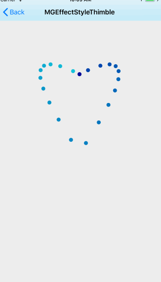
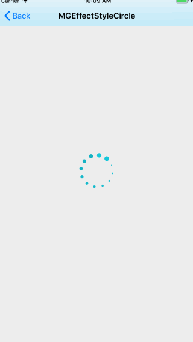
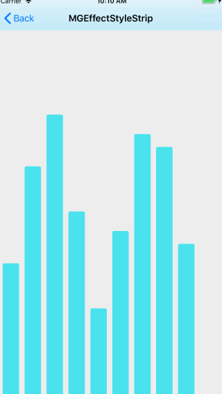
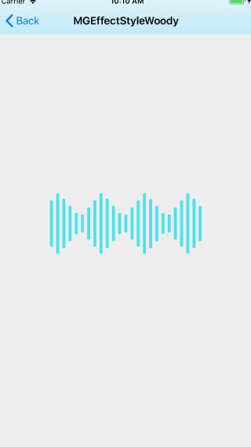
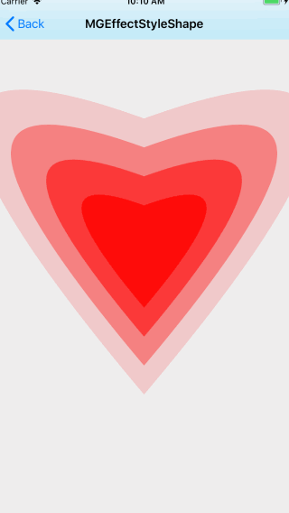
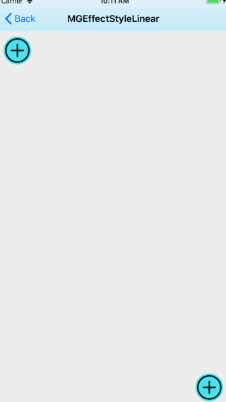

### MGLoaderStyle

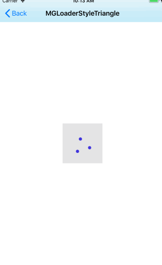
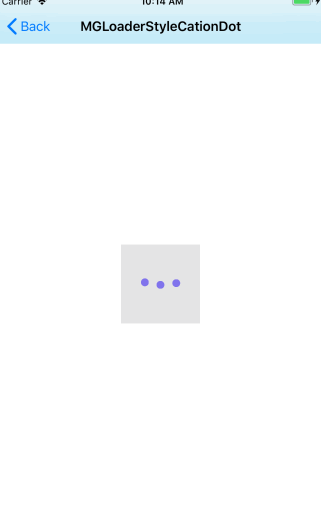
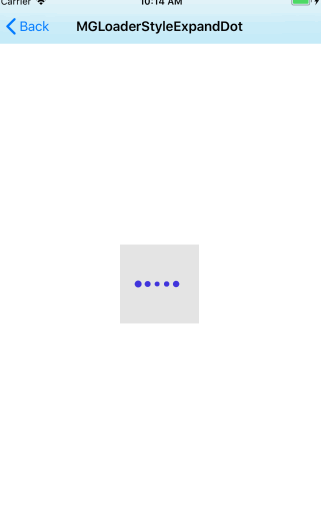
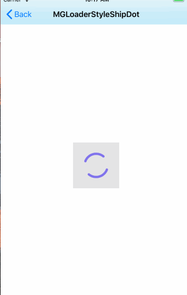
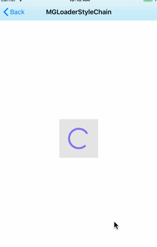
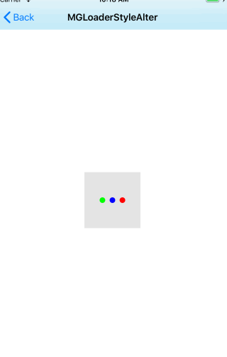
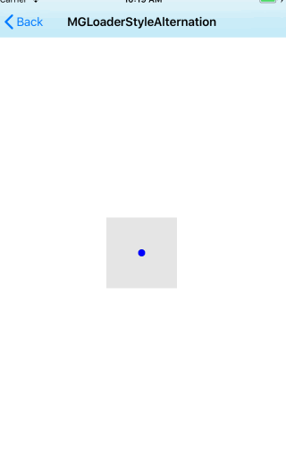
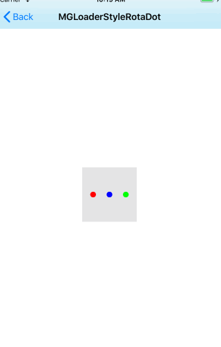

###### 该效果分为2个部分（MGEffectStyle & MGLoaderStyle），还在继续补充...

### MGEffectStyle

- 一些动画，使用`CAReplicatorLayer`复制效果

### MGLoaderStyle

- 加载动画